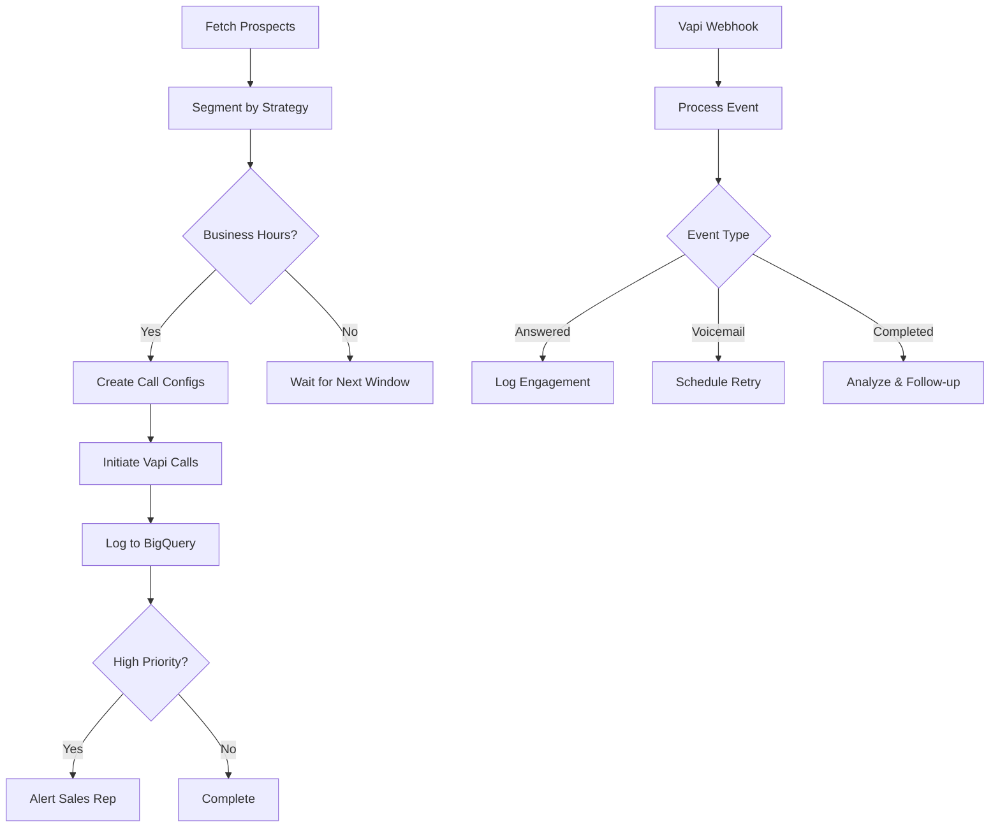

# Vapi Voice Calling Workflow

## Overview
This n8n workflow automates voice calling campaigns using Vapi.ai to engage prospects at different stages of their customer journey. It intelligently segments prospects and applies appropriate calling strategies based on their status and engagement level.

## What is Vapi?
Vapi is an AI voice orchestration platform that enables automated, human-like phone conversations. It manages:
- Speech-to-text (STT) transcription
- Language model processing (LLM)
- Text-to-speech (TTS) synthesis
- Call flow orchestration

## Workflow Components

### 1. Schedule Trigger
- **Frequency**: Every 2 hours
- **Business Hours**: 9 AM - 6 PM PST
- **Purpose**: Regular cadence for outreach calls

### 2. Calling List Generation
Fetches prospects from BigQuery based on:
- **Phone Consent**: Only contacts with `Dealer_Contact_Consent_for_Phone = 'Y'`
- **Valid Phone**: Non-empty phone numbers
- **Status Filtering**: Excludes sold, opted-out, and invalid prospects
- **Recency**: Active within last 30 days

### 3. Call Strategies

| Strategy | Prospect Status | Priority | Description |
|----------|----------------|----------|-------------|
| `immediate_callback` | ***HOT PROSPECT | 1 | Urgent callback for hot leads |
| `reschedule_call` | Appointment Missed/Canceled | 2 | Recover missed appointments |
| `manager_callback` | Manager Help Needed | 1 | High-priority manager attention |
| `follow_up_call` | Working (>3 days) | 3 | Continue nurturing active leads |
| `welcome_call` | New (<1 day) | 3 | First contact with new leads |
| `service_to_sales_call` | Service | 3 | Convert service to sales |
| `winback_call` | Non-Responsive (>7 days) | 4 | Re-engage cold leads |
| `financing_options_call` | Unable to Obtain Financing | 3 | Alternative financing offers |

### 4. Call Frequency Rules

Prevents over-calling with smart throttling:
- **Hot Leads (Priority 1)**: Max once per day
- **Warm Leads (Priority 2)**: Every 2 days
- **Cold Leads (Priority 3-4)**: Every 3 days
- **Weekly Cap**: Maximum 5 calls per prospect per week

### 5. Vapi Assistant Configuration

Different AI assistants for each scenario:
```javascript
assistants: {
  hot_lead: 'asst_hot_lead_id',        // Urgent, sales-focused
  appointment_rescue: 'asst_appointment_id', // Rescheduling focus
  nurture: 'asst_nurture_id',          // Educational, relationship
  winback: 'asst_winback_id',          // Re-engagement tactics
  service_to_sales: 'asst_service_id', // Upselling approach
  financing: 'asst_financing_id'       // Financial solutions
}
```

### 6. Call Scripts

Each strategy has customized messaging:

#### Hot Lead Example:
```
First Message: "Hi [Name], this is a callback from [Dealership] regarding 
your interest in the [Make] [Model]. Is now a good time to talk?"

Voicemail: "Hi [Name], this is [Dealership] returning your call about 
the [Model]. Please call us back at your earliest convenience."
```

#### Appointment Rescue Example:
```
First Message: "Hi [Name], I'm calling from [Dealership]. I noticed you 
had an appointment scheduled that didn't work out. I'd love to help 
reschedule at a more convenient time for you."

Voicemail: "Hi [Name], sorry we missed your appointment. Please call us 
back to reschedule. We're holding the [Model] for you."
```

## Configuration Required

### 1. Vapi Setup
```javascript
// Required Vapi Configuration
{
  apiKey: "YOUR_VAPI_API_KEY",
  phoneNumberId: "YOUR_VAPI_PHONE_NUMBER_ID",
  assistantIds: {
    // Create assistants in Vapi dashboard for each strategy
    hot_lead: "asst_xxx",
    appointment_rescue: "asst_xxx",
    nurture: "asst_xxx",
    winback: "asst_xxx",
    service_to_sales: "asst_xxx",
    financing: "asst_xxx"
  }
}
```

### 2. BigQuery Tables
```sql
-- Required tables
marketing.prospects          -- Source prospect data
marketing.vapi_call_logs     -- Call history tracking
marketing.call_outcomes      -- Call results and transcripts
```

### 3. Webhook Configuration
- **Endpoint**: `/vapi-webhook`
- **Events**: call.started, call.answered, call.ended, voicemail.detected
- **Purpose**: Real-time call status updates

## Call Flow



## Webhook Events Handling

### Event Types:
- **call.started**: Call initiated successfully
- **call.answered**: Customer picked up
- **call.ended**: Call completed (analyze duration/outcome)
- **voicemail.detected**: Left voicemail message

### Follow-up Actions:
- Calls < 30 seconds → Schedule retry
- Appointment scheduled → Send confirmation
- Callback requested → Alert sales rep
- Successful conversation → Update CRM status

## Safety Mechanisms

1. **Business Hours Check**: No calls outside 9 AM - 6 PM
2. **Concurrent Call Limit**: Max 5 simultaneous calls
3. **Call Frequency Caps**: Prevents harassment
4. **Consent Verification**: Only calls opted-in numbers
5. **Recording Compliance**: All calls recorded with notice

## Performance Metrics

### KPIs to Track:
- **Answer Rate**: Target > 40%
- **Average Call Duration**: Target 2-5 minutes
- **Appointment Set Rate**: Target > 15% for hot leads
- **Voicemail Rate**: Expected 30-40%
- **Callback Request Rate**: Target > 10%

### Call Outcome Analysis:
```sql
SELECT 
  call_strategy,
  COUNT(*) as total_calls,
  AVG(duration) as avg_duration,
  SUM(CASE WHEN answered THEN 1 ELSE 0 END) / COUNT(*) as answer_rate,
  SUM(CASE WHEN appointment_set THEN 1 ELSE 0 END) / COUNT(*) as appointment_rate
FROM marketing.vapi_call_logs
WHERE DATE(call_date) >= DATE_SUB(CURRENT_DATE(), INTERVAL 7 DAY)
GROUP BY call_strategy
ORDER BY appointment_rate DESC;
```

## Troubleshooting

### Common Issues:

1. **"No assistants found"**
   - Create assistants in Vapi dashboard
   - Update assistant IDs in workflow

2. **"Calls not connecting"**
   - Verify Vapi phone number is active
   - Check API key permissions
   - Ensure number format is correct (+1XXXXXXXXXX)

3. **"Outside business hours"**
   - Workflow only runs 9 AM - 6 PM
   - Check timezone settings

4. **"Webhook not receiving events"**
   - Configure webhook URL in Vapi dashboard
   - Ensure n8n webhook is active
   - Check firewall/network settings

## Cost Optimization

### Vapi Pricing Considerations:
- **Per-minute billing**: Average $0.10-0.15/minute
- **Optimize call duration**: 2-5 minute target
- **Voicemail detection**: Saves unnecessary minutes
- **Strategic timing**: Call when most likely to answer

### Budget Management:
```javascript
// Monthly budget calculation
const dailyCallTarget = 50;
const avgCallDuration = 3; // minutes
const costPerMinute = 0.12;
const monthlyBudget = dailyCallTarget * avgCallDuration * costPerMinute * 30;
// = $540/month for 50 calls/day at 3 min avg
```

## Integration with Other Workflows

### Triggers Other Workflows:
- Hot lead answered → Alert Google Ads to increase budget
- Appointment set → Create calendar event
- Service interest → Trigger service department notification

### Receives Data From:
- Google Ads workflow → Retargeting campaign performance
- Customer Journey → Stage progression signals

## Compliance Notes

- **TCPA Compliance**: Only call numbers with explicit consent
- **Recording Notice**: First message includes recording disclosure
- **Do Not Call Registry**: Check against DNC list
- **Time Zone Respect**: Call only during local business hours

## Version History

- **v1.0** (2025-01-15): Initial implementation
  - Basic calling strategies
  - Business hours enforcement
  - Call frequency management

---
*Last Updated: 2025-01-15*